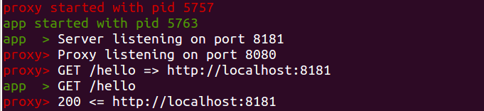

fireup
======

In the world of microservices to test locally our application, we often need to
start multiple processes, each with its own options and environment.
Using _fireup_ we can do this with a single command and watch the output in a
single console, just like a monolith application.

Inspired by [Foreman](http://blog.daviddollar.org/2011/05/06/introducing-foreman.html), [node-foreman](https://github.com/strongloop/node-foreman) and
Cloud Foundry [manifest.yml](https://docs.cloudfoundry.org/devguide/deploy-apps/manifest.html).

What's in:
* Launch multiple processes with a single command
* Aggregate output of all processes in the same console
* All configuration in one yaml file (think of Procfile and .env combined)
* Multi-line environment variables
* For each process specify
  * Shell command to start
  * Environment variables
  * Working directory
* Common env vars for all processes

What's out:
* Scaling (multiple instances of one process type)
* Monitoring and auto restart
* Load balancing and proxying
* Export to other process managers
* Port assignment

## Install

## Example

## Reference
